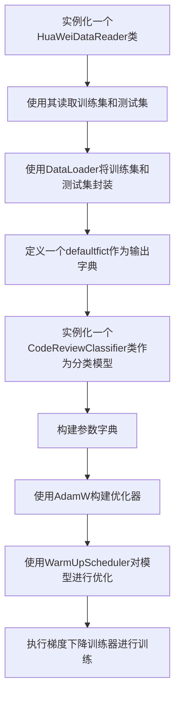

# 代码文档

## BertModel.py

这个文件对Huggingface的Bert源代码进行了修改，可以直接当黑盒使用。

## data_process.py

### Label

这个类提供了标签的一些属性。这些属性包括标签名称`label_name`，列名`column_name`，代码处理方法`CodeProcessType`，英文处理方法`eng_process_type`

### EngProcessTools

这个类用来处理英文，主要方法有:

* `init` 初始化函数。
* `SplitCodeToWordHelper` 切分代码函数，根据驼峰命名法来切分代码。
* `MatchDictHelper` 匹配字典函数，匹配字典中的词进行替换和映射。
* `MatchCodeOnlyHelper` 用词典过滤英文单词，匹配剩下的代码。
* `baseProcess` 用途不明。
* `processDataByProcessTypes` 使用对应的代码处理方法和英文处理方法处理数据。 

### DataTools

这个类用来封装一些对数据的操作，主要方法有：

* `readOrgCodeReview` 从原始数据中切分出严重级别、一级分类、二级分类
* `dropNa`和`dropNaAndDuplicate` __静态方法__ 去空和去重（这两个函数的作用貌似是一样的）。
* `sentimentHelper` __静态方法__ 对于老版的标准，情感有三个等级（0，1，2）。在新版中，1、2合并为一档，这是用来合并的函数。
* `applyAndDropNaAndDuplicate`和`applyAndDropNa`应用上面提到的去空去重方法(这两个函数的作用貌似也是一样的）
* `generateLabelHelper` __静态方法__ 根据三个维度的标签、生成最终的标签。
* `shuffleData` __静态方法__ 打乱数据。
* `dropENgHelper` __静态方法__ 去除全英文的评审意见。
* `generateTestData` 留出测试数据。
* `generateTrainAndValDataByKfolder`和`generateTrainAndValData` __静态方法__ 都是生成k折验证数据集的方法，但是前一个方法好像没用到。

## data_reader.py

### HuaWeiDataReader

顾名思义，这个类用来对华为的数据进行读取，它继承了AllenNLP的DatasetReader，其主要方法有：

* `init` 该方法对以下属性进行初始化：
  * `model_path: str` 模型保存的路径。
  * `eng_data_tool: EngProcessTools` 处理英文的方法。 
  * `label: Label` 标签，保存了标签的一些属性。
  * `inference: bool=False` 是否处于推理模式（推理模式指模型训练好之后实际拿来使用）。
  * `max_tokens: int=512` 最大token数，默认为512。
  * `index_col` 需要读取文件的列名。
* `text_to_instance` 将读取的文本变成一个个的实例(instance)。这个函数中对文本进行了tokenize操作。
* `huawei_data_iterator` 将数据返回成一个迭代器，每次迭代返回行数，文本和标签。
* `_read` 重写AllenNLP的read方法，自动读取数据，给定filepath,返回一个instance。
* `readAllFiles` 读取一个文件路径下的所有文件。

## domain_dict.py

这个文件里面都是一些软工领域专用词的词典，因为为了提高准确性，要针对这些专用词进行操作。这些词典在英文处理类`EngProcessTools`中有用到。

## enums.py

这个文件中的类都继承了Enum类，定义了不同标签对应的类别数量、预处理方法和预处理模型。这里我增加了一个UltimateCategory标签，这个就是多任务分类的标签，可以把多任务分类转变成单任务多分类，其对应如下：

| CrType | Sentiment | Knowledge | UltimateCategory |
| :----: | :-------: | :-------: | :--------------: |
|   1    |     1     |     1     |        0         |
|   1    |     1     |     0     |        1         |
|   1    |     0     |     1     |        2         |
|   0    |     1     |     1     |        3         |
|   1    |     0     |     0     |        4         |
|   0    |     1     |     0     |        5         |
|   0    |     0     |     1     |        6         |
|   0    |     0     |     0     |        7         |

### NumLabels

给出了不同的标签对应的不同数量的类别。

### CodeProcessType

定义了几种代码预处理方法。

### LabelToSemiParam

定义了半监督学习的一些参数

### EngProcessType

定义几种英文预处理方法。

### LabelToEngProcessType

定义了不同标签对应的英文处理方法和预处理模型。

### LabelToCodeProcessType

定义了不同标签对应的代码处理方法和预处理模型。

## Model.py

这个文件是代码中核心模型所在的文件吗，会详细解释。

### CodeReviewClassifier

这是以BERT为主体的，用于训练、验证和预测的有监督模型。

* `init` 初始化模型，主要初始化了以下参数
  
  * `self.num_labels` 标签的个数。
  * `self.out_put_res` 输出路径。
  * `self.bert_model` 从model_path获取模型权重，初始化bert模型。
  * `self.bert_tokenizer` 从model_path获取模型权重，初始化tokenizer。
  * `self.classifier` 使用一个线性层接在BERT模型最后作为分类器。
  * `self._accuracy` 使用AllenNLP提供的CategoricalAccuracy类，用于计算准确度。
  * `self._f1` 使用AllenNLP的F1Measure方法计算f1值。
* `init_project` 线性层，用于构造分类器。
* `forward` 前向传播，主要有以下参数：
  * `input_tensor` 传入的codeReview进过emb后的数据
  * `index` 评审意见对应的唯一ID
  * `label` 训练模型的标签
* `out_put_res` 输出结果，主要有以下参数：
  * `index` 唯一ID
  * `pred` 模型预测出的结果
* `get_metrics` 输出指标
* `get_mask` 获取mask，直接计算最后一个不为0的字符位置。

## train.py

### train_loop __是函数，不是类__

这是训练的主要函数，整个训练流程如下：

